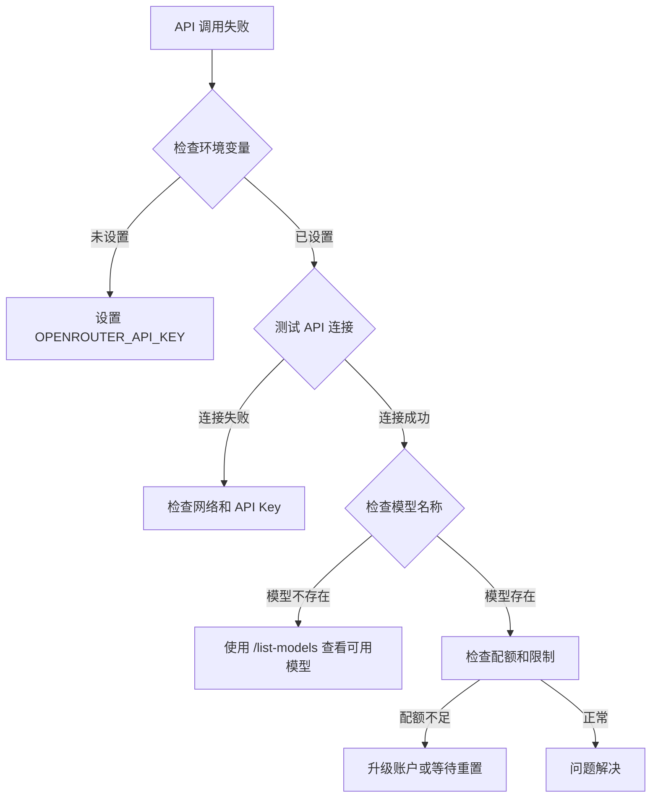

# AI API Proxy Switch Skill - 详细文档

## 目录

1. [概述](#概述)
2. [安装指南](#安装指南)
3. [配置说明](#配置说明)
4. [使用示例](#使用示例)
5. [API 参考](#api-参考)
6. [故障排除](#故障排除)
7. [最佳实践](#最佳实践)
8. [高级配置](#高级配置)
9. [常见问题](#常见问题)
10. [更新日志](#更新日志)

## 概述

### 技能简介

AI API Proxy Switch Skill 是一个 Hermes Agent 技能，它通过 OpenRouter provider 作为适配器，连接到 AI API Proxy 服务，从而实现对多种高级 AI 模型的动态切换。

### 核心优势

1. **零配置切换**：无需修改 Hermes 核心配置文件
2. **模型多样性**：支持 GPT、Claude、Gemini 等主流模型
3. **成本透明**：通过 Clawsocket 控制台清晰查看使用成本
4. **易于集成**：简单的环境变量配置即可使用

### 适用场景

- 需要不同 AI 模型处理不同类型任务的场景
- 需要对比不同模型输出质量的场景
- 需要临时使用高级模型处理复杂任务的场景
- 需要在多个项目间共享 AI 配置的场景

## 安装指南

### 系统要求

- Hermes Agent v0.1.0 或更高版本
- Bash 或 Zsh shell
- 网络连接（用于访问 AI API Proxy）

### 安装方法

#### 方法一：手动安装

```bash
# 创建技能目录（如果不存在）
mkdir -p ~/.hermes/skills/software-development/

# 复制技能文件
cp -r ai-api-proxy-switch ~/.hermes/skills/software-development/
```

#### 方法二：使用安装脚本

```bash
# 下载安装脚本
curl -O https://raw.githubusercontent.com/your-repo/ai-api-proxy-switch/main/install.sh

# 运行安装脚本
chmod +x install.sh
./install.sh
```

### 验证安装

```bash
# 检查技能是否正确安装
hermes skills list | grep ai-api-proxy-switch

# 预期输出应包含 ai-api-proxy-switch
```

## 配置说明

### 必需配置

#### 1. 获取 API Key

1. 访问 [api.clawsocket.com](https://api.clawsocket.com)
2. 注册新账户或登录现有账户
3. 在控制台中找到 API Key（通常以 `cla` 开头）

#### 2. 环境变量设置

##### 临时设置（推荐用于测试）

```bash
export OPENROUTER_API_KEY='cla_xxxxxxxxxxxxxxxxxxxxxxxx'
export OPENROUTER_BASE_URL='https://api.clawsocket.com/v1'
```

##### 永久设置

**Bash 用户：**
```bash
echo 'export OPENROUTER_API_KEY="cla_xxxxxxxxxxxxxxxxxxxxxxxx"' >> ~/.bashrc
echo 'export OPENROUTER_BASE_URL="https://api.clawsocket.com/v1"' >> ~/.bashrc
source ~/.bashrc
```

**Zsh 用户：**
```bash
echo 'export OPENROUTER_API_KEY="cla_xxxxxxxxxxxxxxxxxxxxxxxx"' >> ~/.zshrc
echo 'export OPENROUTER_BASE_URL="https://api.clawsocket.com/v1"' >> ~/.zshrc
source ~/.zshrc
```

### 可选配置

#### 设置默认模型

```bash
export OPENROUTER_MODEL='gpt-5.2'
```

#### 调整超时时间

```bash
# 设置超时时间为 120 秒
export OPENROUTER_TIMEOUT=120
```

## 使用示例

### 基本用法

#### 单次查询

```bash
# 使用 GPT-5.2 进行推理
hermes chat --skills ai-api-proxy-switch --model gpt-5.2 --query "解释量子纠缠的基本原理"

# 使用 Claude-Sonnet 进行创意写作
hermes chat --skills ai-api-proxy-switch --model claude-sonnet-4-6 --query "写一个关于时间旅行的短篇故事开头"

# 使用 Gemini 进行技术分析
hermes chat --skills ai-api-proxy-switch --model gemini-3.1-pro-preview-thinking --query "分析微服务架构的优势和挑战"
```

#### 交互式会话

```bash
# 启动交互式会话
hermes chat --skills ai-api-proxy-switch --model gpt-5.2

# 在交互式会话中，可以连续提问
# 输入 /exit 退出会话
```

### 高级用法

#### 批量处理文件

```bash
# 处理多个问题文件
for file in questions/*.txt; do
    question=$(cat "$file")
    hermes chat --skills ai-api-proxy-switch --model gpt-5.2 --query "$question" > "answers/$(basename "$file")"
done
```

#### 模型对比测试

```bash
#!/bin/bash
# compare_models.sh

QUESTION="解释区块链技术如何确保数据不可篡改"

echo "问题: $QUESTION"
echo ""

MODELS=("gpt-5.2" "claude-sonnet-4-6" "gemini-3.1-pro-preview-thinking")

for model in "${MODELS[@]}"; do
    echo "=== $model ==="
    hermes chat --skills ai-api-proxy-switch --model "$model" --query "$QUESTION" | head -5
    echo ""
done
```

#### 结合其他工具

```bash
# 使用 jq 处理 JSON 输出
hermes chat --skills ai-api-proxy-switch --model gpt-5.2 --query "生成一个包含姓名、年龄、职业的 JSON 数组，包含3个人" | jq .

# 使用 grep 过滤输出
hermes chat --skills ai-api-proxy-switch --model claude-sonnet-4-6 --query "列出 Python 的10个主要特性" | grep -E "^[0-9]+\. "
```

## API 参考

### 环境变量

| 变量名 | 类型 | 默认值 | 描述 |
|--------|------|--------|------|
| `OPENROUTER_API_KEY` | String | 无 | **必需**。AI API Proxy 的 API 密钥 |
| `OPENROUTER_BASE_URL` | String | `https://api.clawsocket.com/v1` | API 端点 URL |
| `OPENROUTER_MODEL` | String | 无 | 默认使用的模型名称 |
| `OPENROUTER_TIMEOUT` | Integer | 60 | API 调用超时时间（秒） |
| `OPENROUTER_MAX_TOKENS` | Integer | 4096 | 最大生成 token 数 |
| `OPENROUTER_TEMPERATURE` | Float | 0.7 | 生成温度（0.0-2.0） |

### 命令行参数

| 参数 | 缩写 | 描述 | 示例 |
|------|------|------|------|
| `--skills` | `-s` | 指定要使用的技能 | `--skills ai-api-proxy-switch` |
| `--model` | `-m` | 指定 AI 模型 | `--model gpt-5.2` |
| `--provider` | `-p` | 指定提供者 | `--provider openrouter` |
| `--query` | `-q` | 查询内容 | `--query "你的问题"` |
| `--temperature` | `-t` | 生成温度 | `--temperature 0.8` |
| `--max-tokens` |  | 最大 token 数 | `--max-tokens 2000` |

### 技能内置命令

在交互式会话中，可以使用以下命令：

| 命令 | 描述 | 示例 |
|------|------|------|
| `/list-models` | 显示所有可用模型 | `/list-models` |
| `/test-connection` | 测试 API 连接 | `/test-connection` |
| `/show-config` | 显示当前配置 | `/show-config` |
| `/switch-model <model>` | 切换模型 | `/switch-model claude-sonnet-4-6` |
| `/help` | 显示帮助信息 | `/help` |

## 故障排除

### 诊断流程



### 常见错误代码

| 错误代码 | 含义 | 解决方案 |
|----------|------|----------|
| 401 | 未授权 | 检查 API Key 是否正确 |
| 403 | 禁止访问 | 检查账户状态和权限 |
| 404 | 模型未找到 | 检查模型名称是否正确 |
| 429 | 请求过多 | 降低请求频率或升级账户 |
| 500 | 服务器错误 | 稍后重试或联系支持 |
| 503 | 服务不可用 | 服务维护中，稍后重试 |

### 调试模式

启用调试模式获取更多信息：

```bash
# 设置调试环境变量
export HERMES_DEBUG=1
export OPENROUTER_DEBUG=1

# 运行命令查看详细日志
hermes chat --skills ai-api-proxy-switch --model gpt-5.2 --query "测试"
```

## 最佳实践

### 性能优化

1. **合理选择模型**
   - 简单任务：使用轻量级模型（gpt-5-mini, claude-haiku）
   - 复杂任务：使用高级模型（gpt-5.2, claude-opus）

2. **优化提示词**
   ```bash
   # 不好的示例：模糊的提示
   hermes chat --model gpt-5.2 --query "帮我写代码"
   
   # 好的示例：具体的提示
   hermes chat --model gpt-5.2 --query "用 Python 写一个函数，接收整数列表，返回所有偶数的平方和"
   ```

3. **批量处理**
   ```bash
   # 将多个相关问题合并为一次请求
   questions="1. 什么是 REST API？\n2. REST API 的主要原则是什么？\n3. 如何设计一个好的 REST API？"
   hermes chat --model gpt-5.2 --query "$questions"
   ```

### 成本控制

1. **监控使用量**
   ```bash
   # 定期检查使用情况
   # 登录 api.clawsocket.com 查看仪表板
   ```

2. **设置使用限制**
   ```bash
   # 使用脚本限制每日使用量
   # limit_usage.sh
   MAX_REQUESTS=100
   CURRENT_REQUESTS=$(cat request_count.txt)
   
   if [ $CURRENT_REQUESTS -ge $MAX_REQUESTS ]; then
       echo "已达到每日使用限制"
       exit 1
   fi
   ```

3. **使用缓存**
   ```bash
   # 缓存常见问题的答案
   CACHE_DIR="$HOME/.hermes/cache/ai-api-proxy"
   mkdir -p "$CACHE_DIR"
   
   query_hash=$(echo "$QUESTION" | md5sum | cut -d' ' -f1)
   cache_file="$CACHE_DIR/$query_hash"
   
   if [ -f "$cache_file" ]; then
       cat "$cache_file"
   else
       hermes chat --model gpt-5.2 --query "$QUESTION" | tee "$cache_file"
   fi
   ```

## 高级配置

### 自定义模型映射

创建自定义模型映射文件 `~/.hermes/models.json`：

```json
{
  "my-gpt": "openai/gpt-5.2",
  "my-claude": "anthropic/claude-sonnet-4-6",
  "fast-code": "openai/gpt-5.3-codex",
  "deep-think": "google/gemini-3.1-pro-preview-thinking"
}
```

使用自定义模型：
```bash
hermes chat --skills ai-api-proxy-switch --model my-gpt --query "问题"
```

### 代理服务器配置

如果需要通过代理访问：

```bash
# 设置代理环境变量
export HTTP_PROXY="http://proxy.example.com:8080"
export HTTPS_PROXY="http://proxy.example.com:8080"
export NO_PROXY="localhost,127.0.0.1"

# 或者使用 socks 代理
export ALL_PROXY="socks5://proxy.example.com:1080"
```

### 自定义请求头

```bash
# 添加自定义请求头
export OPENROUTER_EXTRA_HEADERS='{"X-Custom-Header": "value", "X-Request-ID": "12345"}'
```

## 常见问题

### Q1: 如何查看当前可用的所有模型？
**A**: 使用命令：`hermes chat --skills ai-api-proxy-switch --query "/list-models"`

### Q2: 为什么响应速度很慢？
**A**: 可能的原因：
1. 使用了大型模型（如 GPT-5.2）
2. 网络连接问题
3. AI API Proxy 服务负载高
4. 查询过于复杂

### Q3: 如何保存会话历史？
**A**: Hermes Agent 会自动保存会话历史到 `~/.hermes/history/` 目录。

### Q4: 支持流式输出吗？
**A**: 是的，Hermes Agent 支持流式输出。在交互式会话中会自动启用。

### Q5: 如何在不同项目中使用不同的配置？
**A**: 使用环境变量文件：
```bash
# project1.env
export OPENROUTER_API_KEY="key_for_project1"
export OPENROUTER_MODEL="gpt-5.2"

# 使用配置
source project1.env
hermes chat --skills ai-api-proxy-switch --query "问题"
```

## 更新日志

### v1.1.0 (计划中)
- 添加自定义模型映射功能
- 支持代理服务器配置
- 添加更多诊断工具
- 改进错误处理

### v1.0.0 (2024-04-17)
- 初始版本发布
- 支持主流 AI 模型
- 提供完整的配置指南
- 包含故障排除文档

---

**注意**: 本技能依赖于 AI API Proxy 服务，使用前请确保了解相关服务条款和定价策略。

**技术支持**: 如有问题，请访问 [GitHub Issues](https://github.com/your-repo/ai-api-proxy-switch/issues) 或查看 [Wiki](https://github.com/your-repo/ai-api-proxy-switch/wiki)。